# Nimbus — Clock & Weather for AWTRIX NG

A clock app for [AWTRIX NG](https://github.com/Blueforcer/awtrix-ng) that keeps the time on one side of the display and rotates the other side between the calendar, the outdoor temperature and an animated weather icon. Weather comes from [Open-Meteo](https://open-meteo.com): free, no account, no API key. Everything is built in, so there are no icons to install.

| Date | Temperature |
|:---:|:---:|
| 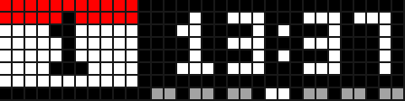 | 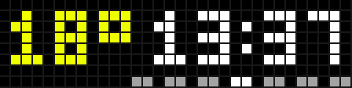 |
| **Weather** | **Night mode** |
| 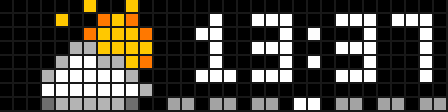 | 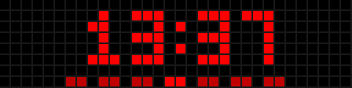 |

<sub>Real frames captured from a Ulanzi TC001, with the time set to 13:37 for the screenshots.</sub>

**Get it on the AWTRIX Hub: [awtrix.de/flow/wQPSUfXDCHbe](https://awtrix.de/flow/wQPSUfXDCHbe)**

## Features

- **Always-on clock**: HH:MM with a pulsing colon, on the left or right side
- **Week bar** under the clock, today highlighted
- **Rotating panel**: calendar → temperature → weather icon, with separate durations for the date and the weather
- **6 transitions**: wipe, scroll up/down, slide left/right, or none
- **Temperature color that follows the weather**: blue at 10 °C and below, orange around 20 °C, red from 30 °C (°C/°F follows the device setting)
- **8 built-in animated weather icons**, day/night aware
- **Night mode**: only a centered red clock and week bar. Turn it on manually, on a schedule, or over MQTT (Home Assistant friendly)
- Time and calendar colors follow the device settings

## Installation

**From the AWTRIX Hub:** install [Nimbus from awtrix.de](https://awtrix.de/flow/wQPSUfXDCHbe).

**Manually:** create a new script in the AWTRIX NG web UI and paste the content of [`nimbus.ax`](nimbus.ax), or upload it over HTTP:

```sh
curl -X PUT -H "Content-Type: text/plain" --data-binary @nimbus.ax \
  http://<clock-ip>/api/v1/apps/script/Nimbus
```

Then open the app settings and set your **latitude** and **longitude** (the default is Paris). You can get them by right-clicking a spot in Google Maps.

## Settings

| Setting | Default | What it does |
|---|---|---|
| Latitude / Longitude | 48.8566 / 2.3522 | Where the weather comes from |
| Weather refresh | 15 min | Time between updates; a failed fetch is retried every minute |
| Date duration | 10 s | How long the calendar stays on screen |
| Temperature / icon duration | 3 s | How long the temperature, then the icon, stay on screen |
| Transition | wipe | `wipe`, `down`, `up`, `left`, `right` or `none` |
| Week days color | #A3A3A3 | Days of the week bar |
| Current day color | #FFFFFF | Today in the week bar |
| Week starts Sunday | off | Otherwise the week starts on Monday |
| Clock on the right | on | Otherwise the clock is on the left |
| Night mode | off | Forces the night mode on |
| Automatic night mode | off | Night mode between *Night mode from* and *until* |
| Night mode from / until | 22 h / 7 h | Hours of the automatic night mode; the window can wrap past midnight |
| Night mode MQTT topic | *(empty)* | Topic Nimbus listens on to switch the night mode; empty disables it |

The clock, temperature unit and calendar colors come from the device settings (`timeColor`, `useCelsius`, `calendarHeaderColor`, `calendarBodyColor`, `calendarTextColor`).

## Night mode

Night mode hides the panel and draws only the clock and the week bar, in red, centered on the display. It is on as soon as one of these says so:

- the **Night mode** setting or the last MQTT message,
- the **Automatic night mode** schedule.

So during the automatic hours, turning the manual switch off doesn't wake the display.

### Over MQTT

Set **Night mode MQTT topic**, then publish `on` or `off` to it (`true`/`false` and `1`/`0` work too, in any case). With Home Assistant:

```yaml
action: mqtt.publish
data:
  topic: awtrix/nimbus/night
  payload: "on"
  retain: true
```

Publish **retained** so the state survives a restart. Note that a retained message is replayed every time the script restarts, which includes saving its settings. While one exists, it overrides the **Night mode** setting; publish a new message to change the state.

> **Tip:** at very low brightness, dim colors can disappear on the LEDs (any color channel below about `0xB2` at the lowest auto-brightness). If your week days vanish at night, pick a lighter color for them.

## Weather icons

| 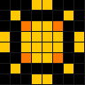 | 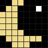 | 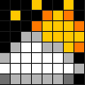 | 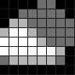 |
|:---:|:---:|:---:|:---:|
| Clear | Clear night | Partly cloudy | Cloudy |
| 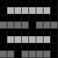 | 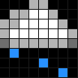 | 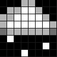 | 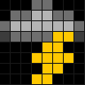 |
| Fog | Rain | Snow | Thunderstorm |

Open-Meteo returns a [WMO weather code](https://open-meteo.com/en/docs) and a day/night flag, mapped as follows:

| Weather code | Icon |
|---|---|
| 0, day | Clear |
| 0–2, night | Clear night |
| 1–2, day | Partly cloudy |
| 3 | Cloudy |
| 45, 48 | Fog |
| 51–67, 80–82 | Rain |
| 71–77, 85–86 | Snow |
| 95–99 | Thunderstorm |

The icons live inside `nimbus.ax` as pixel art strings (see `init()`): one palette letter per pixel, `.` is off and `/` starts the next row. The animations (pulsing rays, twinkling star, drifting fog, falling drops and flakes, flickering bolt) are drawn in `draw_icon()`. To change an icon, edit its string.

## Development

There is no build step: `nimbus.ax` is uploaded as is. Some handy endpoints of the AWTRIX NG HTTP API:

| Endpoint | Use |
|---|---|
| `PUT /api/v1/apps/script/Nimbus` | Install or update the script (`text/plain` body) |
| `GET` / `PATCH /api/v1/apps/Nimbus/config` | Read or change the settings |
| `GET /api/v1/display/screen` | Current frame as 32×8 RGB pixels (JSON), handy to check a layout |
| `GET /api/v1/logs` | Device console, including script errors and memory use |

## Compatibility

Made and tested on the **Ulanzi TC001 (32×8)**. Other panels may work but haven't been tested yet; feedback welcome!

## Credits

Weather data by [Open-Meteo.com](https://open-meteo.com/), licensed under [CC BY 4.0](https://creativecommons.org/licenses/by/4.0/).
